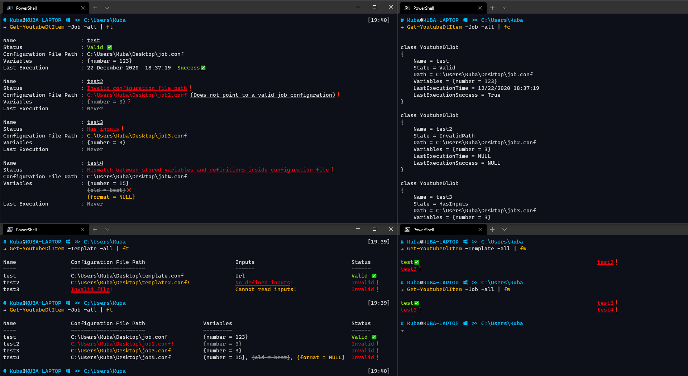

# ytdlWrapper
Powershell-ytdlWrapper is a module aimed at improving ease-of-use and allowing the automation of [youtube-dl](https://github.com/ytdl-org/youtube-dl). The module allows for creating templates which allow reusing a specific youtube-dl configuration to download certain types of content. The module also allows for the creation of jobs which run 100% automatically and can be set-up to the user's needs.

This module is aimed at anyone who uses youtube-dl regularly, and wants a simpler and more user-friendly way to repeat certain tasks with it.

<br>

[](https://dev.azure.com/KubaP999/ytdlWrapper/_build?definitionId=17)
[](https://www.powershellgallery.com/packages/ytdlWrapper)

[](./LICENSE)

### Table of Contents
1. [Getting Started](#getting-started)
2. [Information & Features](#information--features)
3. [Build Instructions](#build-instructions)
4. [Support](#support)
5. [Contributing](#contributing)
6. [License](#license)

## Getting Started
### Installation
In order to get started with the latest version, simply download the module from the [PSGallery](https://www.powershellgallery.com/packages/ytdlWrapper), or install it from powershell by running:
```powershell
Install-Module ytdlWrapper
```
Installing this module does not mean that it is loaded automatically on start-up. Powershell supports loading modules on-the-fly since v3, however the first time you run a command it can be a bit slow to tab-complete parameters or values. If you would like to load this module on shell start-up, add the following line to `~\Documents\Powershell\Profile.ps1`:
```powershell
Import-Module ytdlWrapper
```

### Requirements
This module requires minimum `Powershell 6`.

This module works on `Windows`, `MacOS`, and `Linux`. 

⚠Whilst there are no platform-specific features in use, this module has not yet been tested on either `macOS` or `Linux` so there are no guarantees it will work 100% of the time.

### Invoking youtube-dl
To invoke youtube-dl with a pre-configured configuration file, run:
```powershell
PS C:\> Invoke-YoutubeDl -Path "~\config.txt"
```
This command will invoke youtube-dl against the configuration file 
`config.txt`. This configuration file must be complete and valid, otherwise
youtube-dl will fail and error.

⚠This module has a complex feature-set. Please read the **help pages** for a full rundown.

## Information & Features
### Documentation
For a detailed rundown and explanation of all the features in this module, view the **help page** by running:
```powershell
Get-Help about_ytdlWrapper
```
For detailed help about a specific command, run:
```powershell
Get-Help <COMMAND NAME> -Full
```

### Extra features
#### Aliases
The cmdlets in this module have default aliases:
|Cmdlet  	          |Alias |
|---------------------|------|
|New-YoutubeDlItem    | nydl |
|Get-YoutubeDlItem    | gydl |
|Set-YoutubeDlItem    | sydl |
|Remove-YoutubeDlItem | rydl |
|Invoke-YoutubeDl     | iydl |

#### Tab completion
The `-Name`/`-Names` parameter supports tab-completion of valid **existing** `Template` or `Job` names in the following cmdlets:
- `Get-YoutubeDlItem`
- `Set-YoutubeDlItem`
- `Remove-YoutubeDlItem`
- `Invoke-YoutubeDl`

#### -WhatIf and -Confirm support
The following cmdlets support `-WhatIf` and `-Confirm` parameters:
- `New-YoutubeDlItem`
- `Set-YoutubeDlItem`
- `Remove-YoutubeDlItem`
- `Invoke-YoutubeDl`

Use `-WhatIf` to see and list what changes a command will do.

Use `-Confirm` to ask for a prompt for every state-altering change.

#### Formatting
The `[YoutubeDlTemplate]` and `[YoutubeDlJob]` objects within this module have custom formatting rules for all views. Simply pipe the output of the `Get-YoutubeDlItem` cmdlet to one of:
| Cmdlet        | Alias |
|---------------|-------|
| Format-List   |  fl   |
| Format-Table  |  ft   |
| Format-Custom |  fc   |
| Format-Wide   |  fw   |

The `Format-Custom` & `Format-List` views contain the largest amount of information regarding the template or job.

⚠This module supports "Fancy" formatting (using colours and emoijs) for enhanced readability. This *only* works within the **Windows Terminal** at the moment (I've not tested this on other terminal emulators, but if you know that they support these extra formatting features then let me know). The example below shows the enhanced formatting.



## Build Instructions
#### Prerequisites
Install the following:
- Powershell Core 7.0.0+
- Pester **4.10.1**
- PSScriptAnalyzer 1.18.0+

#### Clone the git repo
```
git clone https://github.com/KubaP/Powershell-ytdlWrapper.git
```

#### Run the build scripts
Navigate to the root repository folder and run the following commands:
```powershell
& .\build\vsts-prerequisites.ps1
& .\build\vsts-validate.ps1
& .\build\vsts-build-prerequisites
& .\build\vsts-build.ps1 -WorkingDirectory .\ -SkipPublish
```
The built module will be located in the `.\publish` folder.

## Support
⚠If you need help regarding the usage of the module, please see the **help page** by running `Get-Help about_ytdlWrapper`.

If there is a bug/issue, please file it on the github issue tracker.

## Contributing
If you have a suggestion, create a new **Github Issue** detailing the idea.

Feel free to make pull requests if you have an improvement. Only submit a single feature at a time, and make sure that the code is cleanly formatted, readable, and well commented.

## License 
This project is licensed under the GPLv3 license - see [LICENSE.md](./LICENSE) file for details.

### Acknowledgements
Any **youtube-dl** references belongs to the respective owners.
